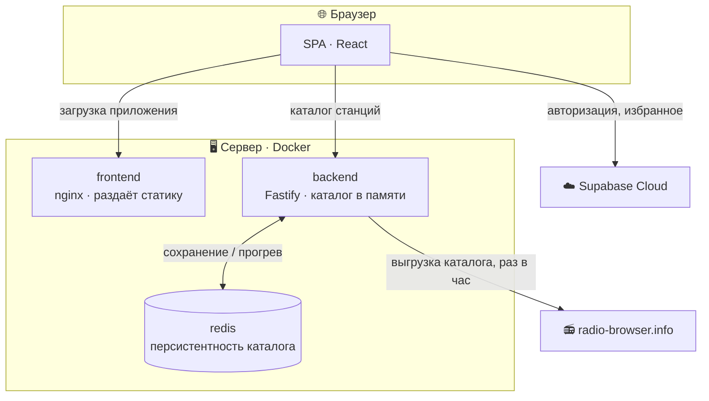
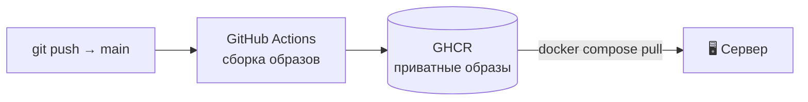

<div align="center">

# 🎧 kaif-radio

**Веб-плеер интернет-радио**


</div>

## О проекте

**kaif-radio** — веб-приложение для прослушивания интернет-радио. Станции берутся
из публичного каталога [radio-browser.info](https://www.radio-browser.info/),
пользовательские данные (аккаунты, избранное) хранятся в Supabase.

---

## Архитектура

Клиент работает с двумя источниками данных, разделёнными по ответственности.



- **Пользовательские данные** (аккаунты, избранное) — клиент обращается к Supabase
  напрямую; доступ ограничен RLS-политиками и публичным ключом `anon`.
- **Данные станций** — клиент обращается только к собственному backend, который
  инкапсулирует работу с radio-browser и Redis. Фронтенд о внешнем каталоге не знает.

Разделение позволяет держать тяжёлую работу с каталогом (выгрузка, кеширование,
перебор зеркал) на сервере, а быстрые операции с пользовательскими данными — на
управляемой платформе Supabase с её встроенной авторизацией. Ключ `service_role`
используется только на backend и никогда не попадает в клиентский код.

---

## Технологии

| Слой               | Стек                                                    |
| ------------------ | ------------------------------------------------------- |
| **Frontend**       | React 19, TypeScript, Vite, react-router 7, CSS Modules |
| **Backend**        | Fastify 5, TypeScript, ioredis                          |
| **Данные**         | Supabase Cloud (Postgres + Auth + RLS), Redis 7         |
| **Инфраструктура** | Docker, docker-compose, nginx                           |
| **CI/CD**          | GitHub Actions → GHCR (приватные образы)                |

Фронтенд построен по **Feature-Sliced Design**: слои `app / pages / widgets /
features / entities / shared`, внутри слайса — `api / model / ui`.

---

## Структура репозитория

```
kaif-radio/
├── frontend/                 SPA (React 19 + TS + Vite, FSD)
│   ├── src/
│   │   ├── app/              провайдеры, роутинг, гварды
│   │   ├── pages/            radio · auth · profile
│   │   ├── widgets/          player · station-list · user-controls
│   │   ├── features/         playback · auth · favorites · genre-filter
│   │   ├── entities/         station · favorite
│   │   └── shared/           ui-kit, хуки, утилиты, supabase-клиент
│   ├── Dockerfile            multi-stage: сборка Vite → раздача nginx
│   └── nginx.conf            SPA-фолбэк для react-router
│
├── backend/                  Fastify API (TS)
│   └── src/
│       ├── stationStore.ts   каталог в памяти + оркестрация обновления
│       ├── stationCache.ts   чтение / запись каталога в Redis
│       ├── redisClient.ts    подключение к Redis
│       ├── radioBrowser/     клиент radio-browser, перебор зеркал
│       └── routes/           HTTP-слой (health, stations)
│
├── docker-compose.yml        локальная разработка
├── docker-compose.prod.yml   прод (готовые образы из GHCR)
└── .github/workflows/        CI: сборка и публикация образов
```

---

## API backend

| Метод | Путь                                 | Описание                                                     |
| ----- | ------------------------------------ | ------------------------------------------------------------ |
| `GET` | `/health`                            | Статус сервиса + состояние каталога (`count`, `refreshedAt`) |
| `GET` | `/stations?genre=lofi&page=1`        | Станции жанра с пагинацией → `{ stations, totalCount }`      |
| `GET` | `/stations/by-uuids?ids=uuid1,uuid2` | Станции по списку uuid (для избранного)                      |

---

## Возможности приложения

- 🎵 Прослушивание станций: движок воспроизведения с ретраями, таймаутами и
  индикацией статуса подключения
- 🔐 Авторизация через Supabase: регистрация, вход, сброс и смена пароля,
  изменение имени
- ⭐ Избранное, привязанное к аккаунту (защита на уровне RLS)
- 🏷️ Фильтрация станций по жанрам
- 📄 Пагинация каталога
- 🎚️ Мини-плеер с управлением громкостью

---

## Локальный запуск

Backend и Redis поднимаются в Docker, фронтенд — Vite dev-сервером.

```bash
# 1. Backend + Redis
docker compose up -d

# 2. Frontend
cd frontend
cp .env.example .env      # заполнить VITE_SUPABASE_* и VITE_API_URL
npm install
npm run dev
```

Переменные окружения фронтенда (`frontend/.env`):

```ini
VITE_API_URL=http://localhost:3000
VITE_SUPABASE_URL=https://<project>.supabase.co
VITE_SUPABASE_ANON_KEY=<anon-key>
```

### Команды

<table>
<tr><th>frontend/</th><th>backend/</th></tr>
<tr><td>

```bash
npm run dev      # Vite dev-сервер
npm run build    # tsc -b && vite build
npm run lint     # eslint
npm run format   # prettier
```

</td><td>

```bash
npm run dev      # tsx watch
npm run build    # tsc
npm run lint     # eslint
```

</td></tr>
</table>

---

## Деплой

Приложение упаковано в docker-образы и разворачивается на VPS.



- Пуш в `main` запускает **GitHub Actions**, которые собирают образы frontend и
  backend и публикуют их в **GitHub Container Registry** (приватные, теги
  `latest` + `sha-<hash>` для отката).
- Сервер ничего не собирает — только скачивает готовые образы:
  `docker compose -f docker-compose.prod.yml pull && up -d`.
- Прод-образ backend — скомпилированный JS без dev-зависимостей; Redis доступен
  только во внутренней сети docker.

---

<div align="center">
<sub>Проект в активной разработке · MVP</sub>
</div>
